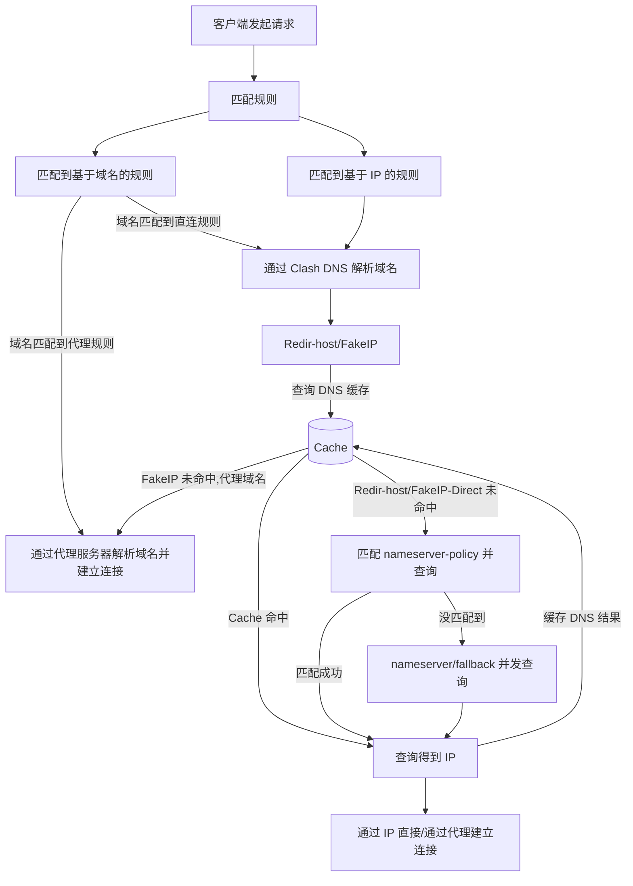

最近几天观察到，**访问部分国内网站**时clash内核日志经常出现**I/O timeout**或者**DNS no resolve**的警告

排查发现可能原因如下

1. <u>配置文件中DNS服务器配置没有写好</u>
2. <u>在拥有ipv6地址时，配置文件未设置</u>​<u>​`ipv6: true`​</u>​
3. <u>在拥有ipv6地址时，配置文件中</u>​<u>**DNS条目**</u>​<u>未设置</u>​<u>​`ipv6: true`​</u>​

解决方法

1. 问题1，按照wiki模板修改dns配置

    ```yaml
    dns:
      enable: true
      use-hosts: true
      use-system-hosts: true
      listen: 0.0.0.0:1053
      ipv6: false
      default-nameserver:
        - 223.5.5.5
      enhanced-mode: fake-ip
      fake-ip-range: 198.18.0.1/16
      nameserver:
        - https://doh.pub/dns-query
        - https://dns.alidns.com/dns-query
      fallback:
        - tls://8.8.4.4
        - tls://1.1.1.1
      proxy-server-nameserver:
        - https://doh.pub/dns-query
      direct-nameserver:
        - system
      fallback-filter:
        geoip: true
        geoip-code: CN
        geosite:
          - gfw
    ```
2. 问题23，关闭ipv6，或者在配置文件或GUI中打开Ipv6相关设置项

各条目详细解释见[DNS配置 - 虚空终端 Docs (metacubex.one)](https://wiki.metacubex.one/config/dns/)

DNS解析流程如下，忽略了 Clash 内部的 DNS 映射处理

<div>
<div class="mermaid"></div>
</div>



‍
