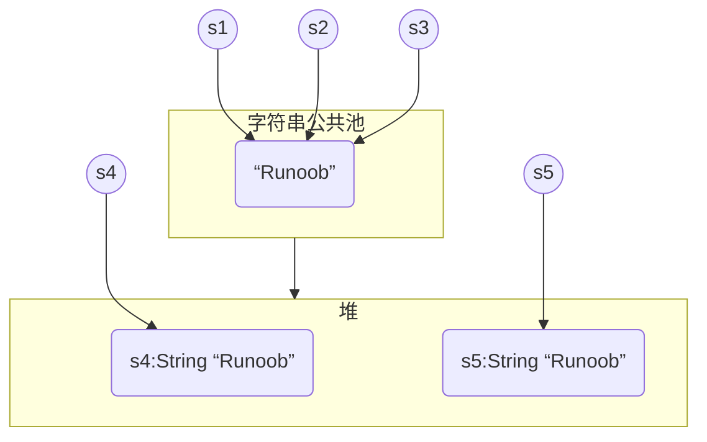

## Java String

​`String` ​是一个引用类型，它本身也是一个 `class`​

Java 编译器对 `String` ​有特殊处理，即可以直接用 `"..."` ​来表示一个字符串

字符串在 `String` ​内部是通过一个 `char[]` ​数组表示的

```java
String s1 = new String(new char[] {'H', 'e', 'l', 'l', 'o', '!'});
```

Java 字符串的一个重要特点就是<span style="font-weight: bold;" data-type="strong"><u>字符串不可变</u></span>

String 类中通过内部的 `private final char[]` ​字段存储字段，同时内部不存在任何修改 `char[]` ​的方法，以此保证字符串不可修改

### String 内存存储

String 创建的字符串存储在字符串常量池 `String Pool` ​中，而 new 创建的字符串对象在堆 `Heap` ​上

```java
String s1 = "Runoob";              // String 直接创建
String s2 = "Runoob";              // String 直接创建
String s3 = s1;                    // 相同引用
String s4 = new String("Runoob");   // String 对象创建
String s5 = new String("Runoob");   // String 对象创建
```



> 在字符串常量池中，每个唯一字符串<u>只会存储一次</u>，再次创建一个相同的字符串字面量时，会将已经在字符串常量池中存在的<u>字符串的内存地址</u>返回给我们

在使用字符串的方法改变字符串内容时，Java 实际上会<u><span style="font-weight: bold;" data-type="strong">创建一个新的字符串对象来存储修改后的字符串</span></u>，将新的对象的引用返回，内存中原始的字符串对象不会被改变，如果没有其他引用指向原本的字符串，则会被垃圾收集器回收

### String 比较

实际上是想比较字符串的内容是否相同，使用 `equals()` ​方法而不能用 `==`​

```java
public class Main {
    public static void main(String[] args) {
        String s1 = "hello";
        String s2 = "hello";
        System.out.println(s1 <span style="font-weight: bold;" class="mark"> s2);
        System.out.println(s1.equals(s2));
    }
}
```

​`</span>` ​实际上比较的是内存地址，而 `equals()` ​比较的才是字符串内容，此处输出相同是因为他们的字符串内容相同，都指向在字符串常量池中的同一个对象

```java
public class Main {
    public static void main(String[] args) {
        String s1 = "hello";
        String s2 = "HELLO".toLowerCase();
        System.out.println(s1 <span style="font-weight: bold;" class="mark"> s2);
        System.out.println(s1.equals(s2));
    }
}
```

s1 直接指向字符串常量池中的"hello"，

s2 是通过调用"HELLO".toLowerCase()创建的，这个方法会<u>返回一个新的字符串对象，存储于堆上</u>

因此两者的内存地址并不相同，此时 `</span>` ​输出 false

### String 长度

用于获取有关对象的信息的方法称为访问器方法

String 类的一个访问器方法是 `length()`​ 方法，它返回字符串对象包含的字符数

### String 连接

String 类提供了连接两个字符串的方法：

```java
string1.concat(string2);
```

返回 string2 连接 string1 的新字符串

也可以对字符串常量使用 `concat()`​ 方法，如

```
"我的名字是 ".concat("Runoob");
```

使用'+'操作符来连接字符串

```
"Hello," + " runoob" + "!"
```

两种方法创建的新字符串对象都存储在堆中

更多 String 方法参考 [Java String API 文档](https://www.runoob.com/manual/jdk11api/java.base/java/lang/String.html)

## Java StringBuilder

为了能高效拼接字符串，Java 标准库提供了 `StringBuilder`​，它是一个可变对象，可以预分配缓冲区，这样，往 `StringBuilder` ​中新增字符时，<span style="font-weight: bold;" data-type="strong">不会创建新的临时对象</span>

```java
StringBuilder sb = new StringBuilder(1024);
for (int i = 0; i < 1000; i++) {
    sb.append(',');
    sb.append(i);
}
String s = sb.toString();
```

注意：对于普通的字符串 `+` ​操作，并不需要我们将其改写为 `StringBuilder`​

因为 Java 编译器在编译时就自动把多个连续的 `+` ​操作编码为 `StringConcatFactory` ​的操作。在运行期，`StringConcatFactory` ​会<span style="font-weight: bold;" data-type="strong">自动</span>把字符串连接操作优化为数组复制或者 `StringBuilder` ​操作

> ​`StringBuilder` ​和 `StringBuffer` ​接口完全相同，现在完全没有必要使用 `StringBuffer`​

## Java包装类型

把 `int` ​基本类型变成一个引用类型，可以定义一个 `Integer` ​类，它只包含一个实例字段 `int`​，这样，`Integer` ​类就可以视为 `int` ​的包装类 `Wrapper Class`​

```java
public class Integer {
    private int value;

    public Integer(int value) {
        this.value = value;
    }

    public int intValue() {
        return this.value;
    }
}
```

定义好了 `Integer` ​类，就可以把 `int` ​和 `Integer` ​互相转换

```java
Integer n = null;
Integer n2 = new Integer(99);
int n3 = n2.intValue();
```

Java 核心库中基本类型对应的包装类型

|基本类型|对应的引用类型|
| :-------| :------------------|
|boolean|java.lang.Boolean|
|byte|java.lang.Byte|
|short|java.lang.Short|
|int|java.lang.Integer|
|long|java.lang.Long|
|float|java.lang.Float|
|double|java.lang.Double|
|char|java.lang.Character|

### 自动装箱

Java 编译器可以自动在 `int` ​和 `Integer` ​之间转型，称为自动装箱/拆箱

```java
Integer n = 100; // 编译器自动使用Integer.valueOf(int)
int x = n; // 编译器自动使用Integer.intValue()
```

### 不变类

所有的包装类型都是不变类

和 String 一样，实例进行比较要特别注意：绝对不能用 `==`​​比较，因为 `Integer`​​是<span style="font-weight: bold;" data-type="strong">*<u>引用类型</u></span>*，必须使用 `equals()`​​比较

创建 `Integer` ​有两种方法

* 方法 1：`Integer n = new Integer(100);`​
* 方法 2：`Integer n = Integer.valueOf(100);`​

使用方法 2 更优，能创建新对象的静态方法称为<span style="font-weight: bold;" data-type="strong">静态工厂方法</span>，

> 创建新对象时，优先选用静态工厂方法而不是 new 操作符

包装类型提供的大量实用方法参考 [Java API 文档](https://www.runoob.com/manual/jdk11api/index.html)

## Java枚举类

Java 枚举是一个特殊的类，<u>一般表示一组常量</u>，比如一年的 4 个季节，一年的 12 个月份，一个星期的 7 天，方向有东南西北等

Java 枚举类使用 `enum`​ 关键字来定义，为<span style="font-weight: bold;" data-type="strong">*<u>引用类型</u></span>*，各个常量使用逗号 `,`​ 来分割

```java
enum Color 
{ 
    RED, GREEN, BLUE; 
} 
```

可以使用 for 语句来<span style="font-weight: bold;" data-type="strong">迭代枚举元素</span>：

```java
enum Color
{
    RED, GREEN, BLUE;
}
public class MyClass {
  public static void main(String[] args) {
    for (Color myVar : Color.values()) {
      System.out.println(myVar);
    }
  }
}
```

<span style="font-weight: bold;" data-type="strong">switch 中使用</span>

```java
enum Color
{
    RED, GREEN, BLUE;
}
public class MyClass {
  public static void main(String[] args) {
    Color myVar = Color.BLUE;

    switch(myVar) {
      case RED:
        System.out.println("红色");
        break;
      case GREEN:
         System.out.println("绿色");
        break;
      case BLUE:
        System.out.println("蓝色");
        break;
    }
  }
}
```

只能定义出`enum`​的实例，无法通过`new`​操作符创建`enum`​的实例

定义的`enum`​类型总是继承自`java.lang.Enum`​，且<u>无法被继承</u>

### 枚举类内置方法

以下为常用方法，更多参考 [Java API 文档](https://www.runoob.com/manual/jdk11api/index.html)

1. ​`values()`​​：返回一个包含枚举类中所有值的数组。数组中的值的顺序与它们在枚举类中定义的顺序相同

    ```java
    Day[] days = Day.values();
    for (Day day : days) {
        System.out.println(day);
    }
    ```
2. ​`ordinal()`​​：返回枚举值在枚举类中的位置，位置从 0 开始计数

    ```java
    Day day = Day.MONDAY;
    System.out.println(day.ordinal());  // 输出 "0"
    ```
3. ​`valueOf()`​​：接受一个字符串参数，返回与该字符串对应的枚举值。如果枚举类中没有与该字符串对应的值，这个方法会抛出 `IllegalArgumentException`​​

    ```java
    Day day = Day.valueOf("MONDAY");
    System.out.println(day);  // 输出 "MONDAY"
    ```
4. ​`name()`​返回常量名

    ```java
    String s = Weekday.SUN.name(); // "SUN"
    ```

### 枚举类成员

可以有变量、方法、构造函数，构造函数只能使用 private，外部无法调用

枚举可以包含抽象方法，抽象方法实现，需要<u>枚举类中的每个对象都对其进行实现</u>

```java
enum Color{
    RED{
        public String getColor(){//枚举对象实现抽象方法
            return "红色";
        }
    },
    GREEN{
        public String getColor(){//枚举对象实现抽象方法
            return "绿色";
        }
    },
    BLUE{
        public String getColor(){//枚举对象实现抽象方法
            return "蓝色";
        }
    };
    public abstract String getColor();//定义抽象方法
}

public class Test{
    public static void main(String[] args) {
        for (Color c:Color.values()){
            System.out.print(c.getColor() + "、");
        }
    }
}
```

同样的，如果包含成员变量，则需要<u>枚举类中的每个对象都包含该成员变量</u>

```java
enum Weekday {
    MON(1), TUE(2), WED(3), THU(4), FRI(5), SAT(6), SUN(0);
    public final int dayValue;
    private Weekday(int dayValue) {
        this.dayValue = dayValue;
    }
}
```

## Java记录类

从Java 14开始，引入了新的`Record`​类。定义`Record`​类时，使用关键字`record`​

1. 定义时使用`final`​，无法派生子类
2. 每个字段使用`final`​，保证创建实例后无法修改任何字段

使用`record`​关键字，可以<u>一行写出一个不变类，同时自动包含必要方法</u>

```java
public class Main {
    public static void main(String[] args) {
        Point p = new Point(123, 456);
        System.out.println(p.x());
        System.out.println(p.y());
        System.out.println(p);
    }
}

record Point(int x, int y) {}
```

把上述定义改写为class，相当于以下代码：

```java
final class Point extends Record {
    private final int x;
    private final int y;

    public Point(int x, int y) {
        this.x = x;
        this.y = y;
    }

    public int x() {
        return this.x;
    }

    public int y() {
        return this.y;
    }

    public String toString() {
        return String.format("Point[x=%s, y=%s]", x, y);
    }

    public boolean equals(Object o) {
        ...
    }
    public int hashCode() {
        ...
    }
}
```

除了用`final`​修饰class以及每个字段外，编译器还<span style="font-weight: bold;" data-type="strong">自动</span>创建了构造方法，和字段名同名的方法，以及覆写`toString()`​、`equals()`​和`hashCode()`​方法

### 构造方法

编译器默认按照`record`​声明的变量顺序自动创建一个构造方法，并在方法内给字段赋值

如果有检查参数的需求，可以给构造方法加上检查逻辑，我们自定义的构造方法被称为`Compact Constructor`​，而编译器最终生成的构造方法如下

```java
public final class Point extends Record {
    public Point(int x, int y) {
        // 这是我们编写的Compact Constructor:
        if (x < 0 || y < 0) {
            throw new IllegalArgumentException();
        }
        // 这是编译器继续生成的赋值代码:
        this.x = x;
        this.y = y;
    }
    ...
}
```

作为`record`​的`Point`​仍然可以添加静态方法

## Java大整数类

​`java.math.BigInteger`​用来表示任意大小的整数

​`BigInteger`​内部用一个`int[]`​数组来模拟一个非常大的整数

```java
BigInteger bi = new BigInteger("1234567890");
System.out.println(bi.pow(5)); // 2867971860299718107233761438093672048294900000
```

对`BigInteger`​做运算的时候，只能使用实例方法，例如，加法运算：

```java
BigInteger i1 = new BigInteger("1234567890");
BigInteger i2 = new BigInteger("12345678901234567890");
BigInteger sum = i1.add(i2); // 12345678902469135780
```

​`BigInteger`​没有范围限制，但缺点是速度比较慢

### 构造方法

```java
public void testScale()
{
    //在构造将函数时，把radix进制的字符串转化为BigInteger
    String str = "1011100111";
    int radix = 2;
    BigInteger interNum1 = new BigInteger(str, radix);    //743

    //不写，则是默认成10进制转换，如下：
    BigInteger interNum2 = new BigInteger(str);            //1011100111
}
```

### 运算

|<span style="font-weight: bold;" data-type="strong">方法</span>|<span style="font-weight: bold;" data-type="strong">用途</span>|
| ------| --------------------------------------------------|
|​`add(a, b)`​|将两个数相加|
|​`subtract(a, b)`​|从第一个数中减去第二个数|
|​`multiply(a, b)`​|将两个数相乘|
|​`divide(a, b)`​|将第一个数除以第二个数|
|​`mod(a, b)`​|返回第一个数除以第二个数的余数|
|​`remainder(a, b)`​|返回第一个数除以第二个数的余数（与 `mod`​ 方法相似）|
|​`pow(a, b)`​|返回 `a`​ 的 `b`​ 次幂|
|​`abs(a)`​|返回 `a`​ 的绝对值|
|​`negate(a)`​|返回 `a`​ 的相反数|

返回值均为`BigIntegar`​

```java
public void testBasic()
{
    BigInteger a = new BigInteger("13");
    BigInteger b = new BigInteger("4");
    int n = 3;

    //1.加
    BigInteger bigNum1 = a.add(b);            //17
    //2.减
    BigInteger bigNum2 = a.subtract(b);        //9
    //3.乘
    BigInteger bigNum3 = a.multiply(b);        //52
    //4.除
    BigInteger bigNum4 = a.divide(b);        //3
    //5.取模(需 b > 0，否则出现异常：ArithmeticException("BigInteger: modulus not positive"))
    BigInteger bigNum5 = a.mod(b);            //1
    //6.求余
    BigInteger bigNum6 = a.remainder(b);    //1
    //7.平方(需 n >= 0，否则出现异常：ArithmeticException("Negative exponent"))
    BigInteger bigNum7 = a.pow(n);            //2197
    //8.取绝对值
    BigInteger bigNum8 = a.abs();            //13
    //9.取相反数
    BigInteger bigNum9 = a.negate();        //-13
}
```

​`compareTo()`​返回一个int型数据：1 大于； 0 等于； -1 小于；

​`max()`​，`min()`​：分别返回大的（小的）BigInteger数据

```java
public void testCompare()
{
    BigInteger bigNum1 = new BigInteger("52");
    BigInteger bigNum2 = new BigInteger("27");

    //1.compareTo()：返回一个int型数据（1 大于； 0 等于； -1 小于）
    int num = bigNum1.compareTo(bigNum2);            //1

    //2.max()：直接返回大的那个数，类型为BigInteger
    BigInteger compareMax = bigNum1.max(bigNum2);    //52

    //3.min()：直接返回小的那个数，类型为BigInteger
    BigInteger compareMin = bigNum1.min(bigNum2);    //27
}
```

更多参考 [Java API 文档](https://www.runoob.com/manual/jdk11api/index.html)

## Java大浮点数类

和`BigInteger`​类似，`BigDecimal`​可以表示一个任意大小且精度完全准确的浮点数

### BigDecimal​构造

```java
BigDecimal BigDecimal(double d); //不允许使用,精度不能保证
BigDecimal BigDecimal(String s); //常用,推荐使用
static BigDecimal valueOf(double d); //常用,推荐使用
```

### 运算

|方法|描叙|
| ----------------------| --------------------------------------------|
|add(BigDecimal)|BigDecimal对象中的值相加，然后返回这个对象|
|subtract(BigDecimal)|BigDecimal对象中的值相减，然后返回这个对象|
|multiply(BigDecimal)|BigDecimal对象中的值相乘，然后返回这个对象|
|divide(BigDecimal)|BigDecimal对象中的值相除，然后返回这个对象|
|toString()|将BigDecimal对象的数值转换成字符串|
|doubleValue()|将BigDecimal对象中的值以双精度数返回|
|floatValue()|将BigDecimal对象中的值以单精度数返回|
|longValue()|将BigDecimal对象中的值以长整数返回|
|intValue()|将BigDecimal对象中的值以整数返回|

更多参考 [Java API 文档](https://www.runoob.com/manual/jdk11api/index.html)

‍
