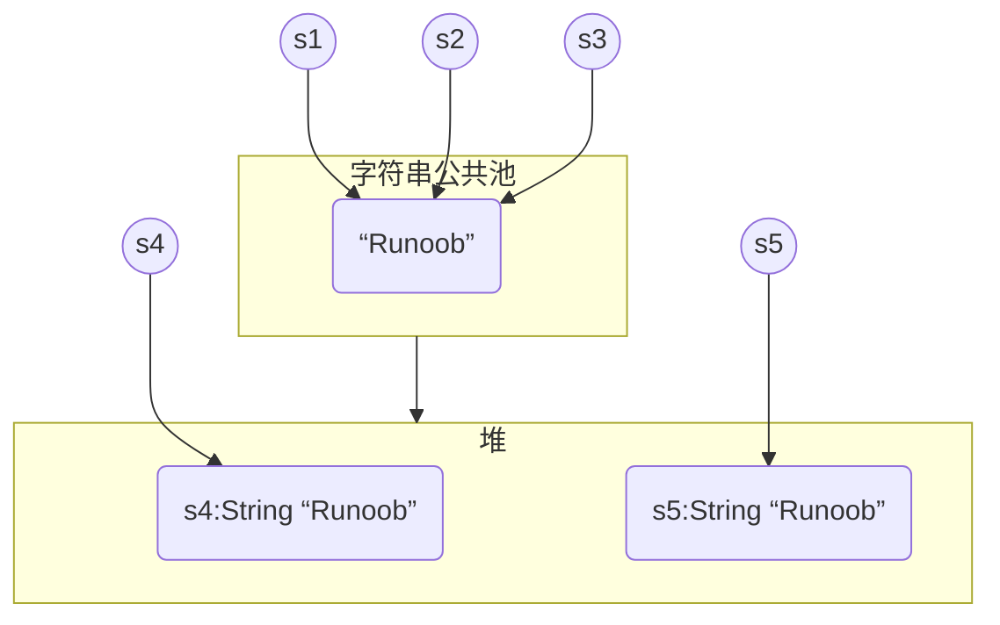

## String

​`String`​是一个引用类型，它本身也是一个`class`​

Java编译器对`String`​有特殊处理，即可以直接用`"..."`​来表示一个字符串

字符串在`String`​内部是通过一个`char[]`​数组表示的

```java
String s1 = new String(new char[] {'H', 'e', 'l', 'l', 'o', '!'});
```

Java字符串的一个重要特点就是<span style="font-weight: bold;" data-type="strong"><u>字符串不可变</u></span>

String类中通过内部的`private final char[]`​字段存储字段，同时内部不存在任何修改`char[]`​的方法，以此保证字符串不可修改

### String内存存储

String 创建的字符串存储在字符串常量池`String Pool`​中，而 new 创建的字符串对象在堆`Heap`​上

```java
String s1 = "Runoob";              // String 直接创建
String s2 = "Runoob";              // String 直接创建
String s3 = s1;                    // 相同引用
String s4 = new String("Runoob");   // String 对象创建
String s5 = new String("Runoob");   // String 对象创建
```



> 在字符串常量池中，每个唯一字符串<u>只会存储一次</u>，再次创建一个相同的字符串字面量时，会将已经在字符串常量池中存在的<u>字符串的内存地址</u>返回给我们

在使用字符串的方法改变字符串内容时，Java实际上会<u><span style="font-weight: bold;" data-type="strong">创建一个新的字符串对象来存储修改后的字符串</span></u>，将新的对象的引用返回，内存中原始的字符串对象不会被改变，如果没有其他引用指向原本的字符串，则会被垃圾收集器回收

### String比较

实际上是想比较字符串的内容是否相同，使用`equals()`​方法而不能用`==`​

```java
public class Main {
    public static void main(String[] args) {
        String s1 = "hello";
        String s2 = "hello";
        System.out.println(s1 <span style="font-weight: bold;" class="mark"> s2);
        System.out.println(s1.equals(s2));
    }
}
```

​`</span>`​实际上比较的是内存地址，而`equals()`​比较的才是字符串内容，此处输出相同是因为他们的字符串内容相同，都指向在字符串常量池中的同一个对象

```java
public class Main {
    public static void main(String[] args) {
        String s1 = "hello";
        String s2 = "HELLO".toLowerCase();
        System.out.println(s1 <span style="font-weight: bold;" class="mark"> s2);
        System.out.println(s1.equals(s2));
    }
}
```

s1直接指向字符串常量池中的"hello"，

s2是通过调用"HELLO".toLowerCase()创建的，这个方法会<u>返回一个新的字符串对象，存储于堆上</u>

因此两者的内存地址并不相同，此时`</span>`​输出false

### String长度

用于获取有关对象的信息的方法称为访问器方法

String 类的一个访问器方法是 `length()`​ 方法，它返回字符串对象包含的字符数

### String连接

String 类提供了连接两个字符串的方法：

```java
string1.concat(string2);
```

返回 string2 连接 string1 的新字符串

也可以对字符串常量使用 `concat()`​ 方法，如

```
"我的名字是 ".concat("Runoob");
```

使用'+'操作符来连接字符串

```
"Hello," + " runoob" + "!"
```

两种方法创建的新字符串对象都存储在堆中

更多String方法参考[Java String API文档](https://www.runoob.com/manual/jdk11api/java.base/java/lang/String.html)

‍
