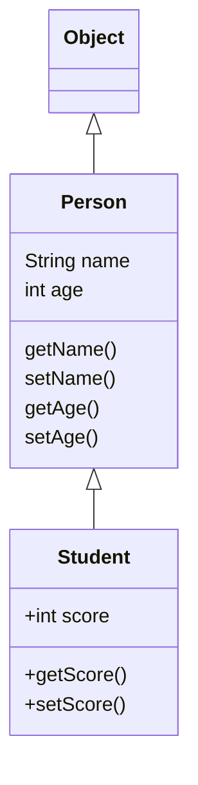

https://www.liaoxuefeng.com/wiki/1252599548343744

## java继承

使用`extends`​关键字实现继承，如以下代码11行

```java
class Person {
    private String name;
    private int age;

    public String getName() {...}
    public void setName(String name) {...}
    public int getAge() {...}
    public void setAge(int age) {...}
}

class Student extends Person {
    // 不要重复name和age字段/方法,
    // 只需要定义新增score字段/方法:
    private int score;

    public int getScore() { … }
    public void setScore(int score) { … }
}
```

<u>子类自动获得父类所有字段，重名将产生意料之外的后果，</u>​<u>~~不要给自己找麻烦（~~</u>

在OOP的术语中，我们把  
​`Person`​称为超类（super class），父类（parent class），基类（base class）  
把`Student`​称为子类（subclass），扩展类（extended class）。

所有class都继承自一个父类，若没有<span style="font-weight: bold;" class="mark">明确指明</span>则指向`Object`​​，其没有父类



### 继承保护

子类无法访问父类的`private`​字段或者`private`​方法。

例如在开头的代码中，`Student`​类无法访问`Person`​类的`name`​和`age`​字段

使得子类能够访问父类的字段，修饰符需要使用`protected`​将字段的权限控制在继承树内部

```java
class Person {
    protected String name;
    protected int age;
}

class Student extends Person {
    public String hello() {
        return "Hello, " + name; // OK!
    }
}
```

### super

子类引用父类的字段时，可以用`super.fieldName`​

<u>这是因为在Java中，任何</u>​`class`​<u>的构造方法，第一行语句必须是调用父类的构造方法</u>

若不写，编译器会帮我们自动加一句`super()`​

父类没有默认构造方法时，子类就必须显式调用`super()`​并给出参数以便让编译器定位到父类的一个合适的构造方法。

<u>同时，子类不会继承父类的构造方法</u>

### 阻止继承

从Java 15开始，允许使用`sealed`​修饰class，并通过`permits`​明确写出能够从该class继承的子类名称

```java
public sealed class Shape permits Rect, Circle, Triangle {
    ...
}
```

上述`Shape`​类就是一个`sealed`​类，它只允许指定的3个类继承它。

使用其他的类继承报错

### 转型

把一个子类类型安全地变为父类类型的赋值，被称为向上转型（upcasting）

```java
Student s = new Student();
Person p = s; // upcasting, ok
Object o1 = p; // upcasting, ok
Object o2 = s; // upcasting, ok
```

注意到继承树是`Student > Person > Object`​，所以，可以把`Student`​类型转型为`Person`​，或者更高层次的`Object`​。

但是只能访问该子类对象作为父类对象时的属性和方法，不能访问子类特有的属性和方法

---

把一个父类类型强制转型为子类类型，就是向下转型（downcasting）

向下转型时如果子类功能比父类多，向下转型将会失败，Java虚拟机会报`ClassCastException`​。

> 使用`instanceof`​操作符，实际上判断一个变量所指向的实例是否是指定类型，或者这个类型的子类。如果一个引用变量为`null`​，那么对任何`instanceof`​的判断都为`false`​

利用`instanceof`​，在向下转型前可以先判断，从Java 14开始，判断`instanceof`​后，可以直接转型为指定变量，避免再次强制转型

```java
public class Main {
    public static void main(String[] args) {
        Object obj = "hello";
        if (obj instanceof String s) {
            // 可以直接使用变量s:
            System.out.println(s.toUpperCase());
        }
    }
}
```

## java多态

### 覆写

在继承关系中，子类如果定义了一个与父类方法方法名、参数、返回值相同的方法，被称为覆写（Override）

不相同，则为方法重载（Overload），重载产生的是新方法

方法名相同，方法参数相同，但方法返回值不同，将会报错

```java
class Person {
    public void run() { … }
}

class Student extends Person {
    // 不是Override，因为参数不同:
    public void run(String s) { … }
    // 不是Override，因为返回值不同:
    public int run() { … }
	// 是Override
	public void run() { … }
}
```

​`@Override`​不是必需的

可以通过`super`​调用被父类覆写的方法

```java
class Person {
    protected String name;
    public String hello() {
        return "Hello, " + name;
    }
}

class Student extends Person {
    @Override
    public String hello() {
        // 调用父类的hello()方法:
        return super.hello() + "!";
    }
}
```

### 多态

多态是指，针对某个类型的方法调用，其<u>真正执行的方法取决于运行时期实际类型的方法</u>

```java
public class Main
{
    public static void main(String[] args)
    {
        // 给一个有普通收入、工资收入和享受国务院特殊津贴的小伙伴算税:
        Income[] incomes = new Income[]{
                new Income(3000),
                new Salary(7500),
                new StateCouncilSpecialAllowance(15000)
        };
        System.out.println(totalTax(incomes));
    }

    public static double totalTax(Income... incomes)
    {
        double total = 0;
        for (Income income : incomes)
        {
            total = total + income.getTax();
        }
        return total;
    }
}

class Income
{
    protected double income;

    public Income(double income)
    {
        this.income = income;
    }

    public double getTax()
    {
        return income * 0.1; // 税率10%
    }
}

class Salary extends Income
{
    public Salary(double income)
    {
        super(income);
    }

    @Override
    public double getTax()
    {
        if (income <= 5000)
        {
            return 0;
        }
        return (income - 5000) * 0.2;
    }
}

class StateCouncilSpecialAllowance extends Income
{
    public StateCouncilSpecialAllowance(double income)
    {
        super(income);
    }

    @Override
    public double getTax()
    {
        return 0;
    }
}

```

观察以上代码，多态使得`totalTax()`​方法不需要知道扩展类的存在就可以直接正确计算税。将新的类型传入不需要对计算方法进行任何修改。

​`StateCouncilSpecialAllowance`​和`Salary`​都属于`Income`​的一种，因此可以用引用类型为`Income`​的数组进行存储，在计算时直接使用`Income`​表示，但是实际计算时又依据其各自扩展类中覆写的方法计算，这也是为什么覆写必须与父类完全一致，不一致将会影响运算

## final关键字

1. 阻止子类对父类方法的覆写
2. 阻止类被其他类继承
3. 阻止类实例字段被修改

## 抽象类

父类的方法本身<u>不需要实现任何功能，仅为了定义方法签名</u>，目的是让子类去覆写它，可以把父类的方法声明为抽象方法

```
class Person {
    public abstract void run();
}
```

一个方法声明为`abstract`​抽象方法时，<u>没有实现方法语句，无法单独执行</u>，也就是说<u>包含该抽象方法的类无法实例化</u>，必须同时将类也声明为`abstract`​才能通过编译

```java
abstract class Person {
    public abstract void run();
}
```

因为抽象类本身被设计成只能用于被继承，因此，抽象类可以强迫子类实现其定义的抽象方法，否则编译会报错。因此，<u>抽象方法实际上相当于定义了“规范”</u>

## 接口

在Java中，使用`interface`​可以声明一个接口，接口没有字段，所有方法都是抽象方法，默认都是`public abstract`​不需写出

```java
interface Person {
    void run();
    String getName();
}
```

一个类可以实现多个`interface`​

```java
class Student implements Person, Hello { // 实现了两个interface
    ...
}
```

<span style="font-weight: bold;" data-type="strong">接口和类的相似之处:</span>

|方面|描述|
| ------------------| ----------------------------------------|
|多个方法|接口和类都可以包含多个方法|
|文件扩展名|接口文件以`.java`​结尾，与类文件相同|
|字节码文件扩展名|接口的字节码文件以`.class`​结尾，与类相同|
|目录结构|字节码文件必须在与包名称相匹配的目录中|

<span style="font-weight: bold;" data-type="strong">接口和类的不同之处:</span>

|方面|接口|类|
| ----------| --------------------------------------------------| ------------------------------|
|实例化|不能|可以|
|构造方法|无|有|
|方法类型|所有方法都是抽象的，从 Java 8 开始可以有默认方法|抽象、具体、静态、final 方法|
|成员变量|静态、final 变量|任何类型的成员变量|
|继承|被类实现，支持多继承|被子类继承，支持单继承|

<span style="font-weight: bold;" data-type="strong">接口的特点:</span>

|方面|描述|
| ----------| ----------------------------------------|
|方法声明|方法在接口中隐式为 public abstract|
|变量声明|变量在接口中隐式为 public static final|
|方法实现|方法不能在接口中实现|
|多重继承|支持多重继承，一个类可以实现多个接口|

<span style="font-weight: bold;" data-type="strong">抽象类和接口之间的不同之处:</span>

|方面|抽象类|接口|
| ------------------| ------------------------------| -----------------------------------|
|方法实现|可以有具体方法（带有方法体）|方法都是隐式抽象的，不能有方法体|
|成员变量|可以有任何类型的成员变量|变量是隐式 public static final 的|
|静态方法和代码块|可以包含静态方法和静态代码块|不能包含静态方法或静态代码块|
|继承|支持单继承|支持多继承|
|实现|一个类只能继承一个抽象类|一个类可以实现多个接口|
|其他|抽象类可以继承接口||

### 标记接口

标记接口是<u>没有任何方法和属性的接口</u>，仅表明它的类属于一个特定的类型,供其他代码来测试允许做一些事情

~~简而言之就是打标记~~

例如：java.awt.event 包中的 MouseListener 接口继承的 java.util.EventListener 接口定义如下：

```java
package java.util;
public interface EventListener
{}
```

标记接口主要用于以下两种目的：

* <span style="font-weight: bold;" data-type="strong">建立一个公共的父接口：</span>

  正如EventListener接口，这是由几十个其他接口扩展的Java API，你可以使用一个标记接口来建立一组接口的父接口。

  例如：当一个接口继承了EventListener接口，Java虚拟机(JVM)就知道该接口将要被用于一个事件的代理方案。
* <span style="font-weight: bold;" data-type="strong">向一个类添加数据类型：</span>

  这种情况是标记接口最初的目的，实现标记接口的类不需要定义任何接口方法(因为标记接口根本就没有方法)，但是该类通过多态性变成一个接口类型。

## 枚举类

Java 枚举是一个特殊的类，<u>一般表示一组常量</u>，比如一年的 4 个季节，一年的 12 个月份，一个星期的 7 天，方向有东南西北等

Java 枚举类使用 `enum`​ 关键字来定义，各个常量使用逗号 `,`​ 来分割

```java
enum Color 
{ 
    RED, GREEN, BLUE; 
} 
```

可以使用 for 语句来<span style="font-weight: bold;" data-type="strong">迭代枚举元素</span>：

```java
enum Color
{
    RED, GREEN, BLUE;
}
public class MyClass {
  public static void main(String[] args) {
    for (Color myVar : Color.values()) {
      System.out.println(myVar);
    }
  }
}
```

<span style="font-weight: bold;" data-type="strong">switch中使用</span>

```java
enum Color
{
    RED, GREEN, BLUE;
}
public class MyClass {
  public static void main(String[] args) {
    Color myVar = Color.BLUE;

    switch(myVar) {
      case RED:
        System.out.println("红色");
        break;
      case GREEN:
         System.out.println("绿色");
        break;
      case BLUE:
        System.out.println("蓝色");
        break;
    }
  }
}
```

<span style="font-weight: bold;" data-type="strong">三个内置方法</span>

1. ​`values()`​：返回一个包含枚举类中所有值的数组。数组中的值的顺序与它们在枚举类中定义的顺序相同

    ```java
    Day[] days = Day.values();
    for (Day day : days) {
        System.out.println(day);
    }
    ```
2. ​`ordinal()`​：返回枚举值在枚举类中的位置，位置从0开始计数

    ```java
    Day day = Day.MONDAY;
    System.out.println(day.ordinal());  // 输出 "0"
    ```
3. ​`valueOf()`​：接受一个字符串参数，返回与该字符串对应的枚举值。如果枚举类中没有与该字符串对应的值，这个方法会抛出`IllegalArgumentException`​

    ```java
    Day day = Day.valueOf("MONDAY");
    System.out.println(day);  // 输出 "MONDAY"
    ```

### 枚举类成员

可以有变量、方法、构造函数，构造函数只能使用private，外部无法调用

枚举可以包含抽象方法，抽象方法实现，需要枚举类中的每个对象都对其进行实现

```java
enum Color{
    RED{
        public String getColor(){//枚举对象实现抽象方法
            return "红色";
        }
    },
    GREEN{
        public String getColor(){//枚举对象实现抽象方法
            return "绿色";
        }
    },
    BLUE{
        public String getColor(){//枚举对象实现抽象方法
            return "蓝色";
        }
    };
    public abstract String getColor();//定义抽象方法
}

public class Test{
    public static void main(String[] args) {
        for (Color c:Color.values()){
            System.out.print(c.getColor() + "、");
        }
    }
}
```

## 包

包的作用

1. 把功能相似或相关的类或接口组织在同一个包中，方便类的查找和使用
2. 如同文件夹一样，包也采用了<span style="font-weight: bold;" data-type="strong">树形目录的存储方式</span>。<u>同一个包中的类名字是不同的，不同的包中的类的名字是可以相同的</u>，当同时调用两个不同包中相同类名的类时，应该加上包名加以区别。因此，包可以避免名字冲突
3. 包也限定了<u>访问权限</u>，拥有包访问权限的类才能访问某个包中的类

包语句的语法格式为：

```java
package net.java.util;
public class Something{
   ...
}
```

则以上类的路径为`net/java/util/Something.java`​

### 创建包

创建包的时候，需要为这个包取一个合适的名字

如果其他的一个源文件包含了这个包提供的类、接口、枚举或者注释类型的时候，都<u>必须将这个包的声明放在这个源文件的开头</u>

包声明应该在源文件的第一行，<u>每个源文件只能有一个包声明</u>，这个文件中的每个类型都应用于它

如果一个源文件中没有使用包声明，那么其中的类，函数，枚举，注释等将被放在一个无名的包（unnamed package）中

---

假设有一个`animals`​包，存在一个`Animal`​接口和对应的实现

```java
/* 文件名: Animal.java */
package animals;

interface Animal {
   public void eat();
   public void travel();
}
```

```java
package animals;

/* 文件名 : MammalInt.java */
public class MammalInt implements Animal{
   public void eat(){
      System.out.println("Mammal eats");
   }
   public void travel(){
      System.out.println("Mammal travels");
   } 
   public int noOfLegs(){
      return 0;
   }
   public static void main(String args[]){
      MammalInt m = new MammalInt();
      m.eat();
      m.travel();
   }
}
```

### import关键字

引入一个类有四种形式

1. 假设有一个`payroll`​包，当前包含`Employee`​类

    此时在`payroll`​包中的其他类调用它的时候不需要前缀

    ```java
    package payroll;
     
    public class Boss
    {
       public void payEmployee(Employee e)
       {
          e.mailCheck();
       }
    }
    ```
2. ​`Boss`​类不在`payroll`​包中

    1. 使用类全名描述

        ```java
        payroll.Employee
        ```
    2. 使用import引入所有类

        ```java
        import payroll.*;
        ```
    3. 使用import引入单个类

        ```java
        import payroll.Employee;
        ```

可以包含任意数量的import声名，import 声明必须在包声明之后，类声明之前。

```java
// 第一行非注释行是 package 语句
package com.example;
 
// import 语句引入其他包中的类
import java.util.ArrayList;
import java.util.List;
 
// 类的定义
public class MyClass {
    // 类的成员和方法
}
```

### 目录结构

包名必须与相应的字节码所在的目录结构相吻合

正确的类名和路径将会是如下样子：

* 类名 -> vehicle.Car
* 路径名 -> vehicle\Car.java

## 内部类

内部类是指被定义在另一个类内部的类。内部类分为以下几种

### Inner Class

```java
class Outer {
    class Inner {
        // 定义了一个Inner Class
    }
}
```

​`Inner Class`​与普通类有个最大的不同，就是`Inner Class`​的实例不能单独存在，必须依附于一个`Outer Class`​的实例

```java
public class Main {
    public static void main(String[] args) {
        Outer outer = new Outer("Nested"); // 实例化一个Outer
        Outer.Inner inner = outer.new Inner(); // 实例化一个Inner
        inner.hello();
    }
}

class Outer {
    private String name;
    Outer(String name) {
        this.name = name;
    }
    class Inner {
        void hello() {
            System.out.println("Hello, " + Outer.this.name);
        }
    }
}
```

​`Inner Class`​隐式持有一个`Outer Class`​实例，即在内部类中`this`​指向内部类自身，同时还存在一个`Outer.this`​指向外部类

​`Inner Class`​的作用域在`Outer Class`​内部，内部类能够通过`Outer.this`​访问和修改外部类中的`private`​字段

### Anonymous Class

匿名类`Anonymous Class`​不需要在方法内部明确定义Class，通常用于一次性使用的场景

匿名类可以是类的子类，也可以是接口的实现

```java
new superclass_or_interface() {
    // 类体
}
```

这里的`superclass_or_interface`​想要<u>继承的类或者实现的接口</u>，类体中<u>可以包含字段、方法</u>等

例如下列代码创建了实现`Runnable`​接口的匿名类

```java
Runnable r = new Runnable() {
	@Override
    public void run() {
    	System.out.println("Hello, " + Outer.this.name);
    }
};
```

匿名类也可以继承自普通类

```java
public class Main {
    public static void main(String[] args) {
        HashMap<String, String> map1 = new HashMap<>();
        HashMap<String, String> map2 = new HashMap<>() {}; // 匿名类!
        HashMap<String, String> map3 = new HashMap<>() {
            {
                put("A", "1");
                put("B", "2");
            }
        };
        System.out.println(map3.get("A"));
    }
}
```

1. map1 是一个普通的 HashMap 实例，没有使用匿名类。
2. map2 是一个 HashMap 的匿名子类的实例。这里的 {} 定义了一个匿名子类，但是这个子类没有添加或覆盖任何方法，所以它的行为和普通的 HashMap 完全一样
3. map3 也是一个 HashMap 的匿名子类的实例，但是这个子类在定义时使用了一个实例初始化块（也叫初始化器）。初始化器中的代码在创建类的实例时执行，所以 map3 在创建时就已经包含了两个键值对："A"-"1" 和 "B"-"2"

匿名类也是一种内部类，也可以访问`Outer Class`​的`private`​字段和方法

### Static Nested Class

和`Inner Class`​类似，但是使用`static`​修饰，称为静态内部类`Static Nested Class`​

> 用`static`​修饰的内部类和Inner Class有很大的不同，它不再依附于`Outer`​的实例，而是一个完全独立的类，因此无法引用`Outer.this`​

但它可以访问`Outer`​​的`private`​​静态字段和静态方法。如果把`StaticNested`​​移到`Outer`​​之外，就失去了访问`private`​​的权限。

‍
