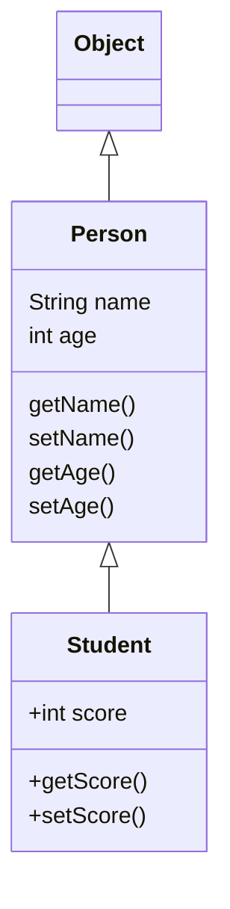

## java继承

使用`extends`​关键字实现继承，如以下代码11行

```java
class Person {
    private String name;
    private int age;

    public String getName() {...}
    public void setName(String name) {...}
    public int getAge() {...}
    public void setAge(int age) {...}
}

class Student extends Person {
    // 不要重复name和age字段/方法,
    // 只需要定义新增score字段/方法:
    private int score;

    public int getScore() { … }
    public void setScore(int score) { … }
}
```

<u>子类自动获得父类所有字段，重名将产生意料之外的后果，</u>​<u>~~不要给自己找麻烦（~~</u>

在OOP的术语中，我们把  
​`Person`​称为超类（super class），父类（parent class），基类（base class）  
把`Student`​称为子类（subclass），扩展类（extended class）。

所有class都继承自一个父类，若没有<span style="font-weight: bold;" class="mark">明确指明</span>则指向`Object`​​，其没有父类



### 继承保护

子类无法访问父类的`private`​字段或者`private`​方法。

例如在开头的代码中，`Student`​类无法访问`Person`​类的`name`​和`age`​字段

使得子类能够访问父类的字段，修饰符需要使用`protected`​将字段的权限控制在继承树内部

```java
class Person {
    protected String name;
    protected int age;
}

class Student extends Person {
    public String hello() {
        return "Hello, " + name; // OK!
    }
}
```

### super

子类引用父类的字段时，可以用`super.fieldName`​

<u>这是因为在Java中，任何</u>​`class`​<u>的构造方法，第一行语句必须是调用父类的构造方法</u>

若不写，编译器会帮我们自动加一句`super()`​

父类没有默认构造方法时，子类就必须显式调用`super()`​并给出参数以便让编译器定位到父类的一个合适的构造方法。

<u>同时，子类不会继承父类的构造方法</u>

### 阻止继承

从Java 15开始，允许使用`sealed`​修饰class，并通过`permits`​明确写出能够从该class继承的子类名称

```java
public sealed class Shape permits Rect, Circle, Triangle {
    ...
}
```

上述`Shape`​类就是一个`sealed`​类，它只允许指定的3个类继承它。

使用其他的类继承报错

### 转型

把一个子类类型安全地变为父类类型的赋值，被称为向上转型（upcasting）

```java
Student s = new Student();
Person p = s; // upcasting, ok
Object o1 = p; // upcasting, ok
Object o2 = s; // upcasting, ok
```

注意到继承树是`Student > Person > Object`​，所以，可以把`Student`​类型转型为`Person`​，或者更高层次的`Object`​。

但是只能访问该子类对象作为父类对象时的属性和方法，不能访问子类特有的属性和方法

---

把一个父类类型强制转型为子类类型，就是向下转型（downcasting）

向下转型时如果子类功能比父类多，向下转型将会失败，Java虚拟机会报`ClassCastException`​。

> 使用`instanceof`​操作符，实际上判断一个变量所指向的实例是否是指定类型，或者这个类型的子类。如果一个引用变量为`null`​，那么对任何`instanceof`​的判断都为`false`​

利用`instanceof`​，在向下转型前可以先判断，从Java 14开始，判断`instanceof`​后，可以直接转型为指定变量，避免再次强制转型

```java
public class Main {
    public static void main(String[] args) {
        Object obj = "hello";
        if (obj instanceof String s) {
            // 可以直接使用变量s:
            System.out.println(s.toUpperCase());
        }
    }
}
```

## java多态

### 覆写

在继承关系中，子类如果定义了一个与父类方法方法名、参数、返回值相同的方法，被称为覆写（Override）

不相同，则为方法重载（Overload），重载产生的是新方法

方法名相同，方法参数相同，但方法返回值不同，将会报错

```java
class Person {
    public void run() { … }
}

class Student extends Person {
    // 不是Override，因为参数不同:
    public void run(String s) { … }
    // 不是Override，因为返回值不同:
    public int run() { … }
	// 是Override
	public void run() { … }
}
```

​`@Override`​不是必需的

可以通过`super`​调用被父类覆写的方法

```java
class Person {
    protected String name;
    public String hello() {
        return "Hello, " + name;
    }
}

class Student extends Person {
    @Override
    public String hello() {
        // 调用父类的hello()方法:
        return super.hello() + "!";
    }
}
```

### 多态

多态是指，针对某个类型的方法调用，其<u>真正执行的方法取决于运行时期实际类型的方法</u>

```java
public class Main
{
    public static void main(String[] args)
    {
        // 给一个有普通收入、工资收入和享受国务院特殊津贴的小伙伴算税:
        Income[] incomes = new Income[]{
                new Income(3000),
                new Salary(7500),
                new StateCouncilSpecialAllowance(15000)
        };
        System.out.println(totalTax(incomes));
    }

    public static double totalTax(Income... incomes)
    {
        double total = 0;
        for (Income income : incomes)
        {
            total = total + income.getTax();
        }
        return total;
    }
}

class Income
{
    protected double income;

    public Income(double income)
    {
        this.income = income;
    }

    public double getTax()
    {
        return income * 0.1; // 税率10%
    }
}

class Salary extends Income
{
    public Salary(double income)
    {
        super(income);
    }

    @Override
    public double getTax()
    {
        if (income <= 5000)
        {
            return 0;
        }
        return (income - 5000) * 0.2;
    }
}

class StateCouncilSpecialAllowance extends Income
{
    public StateCouncilSpecialAllowance(double income)
    {
        super(income);
    }

    @Override
    public double getTax()
    {
        return 0;
    }
}

```

观察以上代码，多态使得`totalTax()`​方法不需要知道扩展类的存在就可以直接正确计算税。将新的类型传入不需要对计算方法进行任何修改。

​`StateCouncilSpecialAllowance`​和`Salary`​都属于`Income`​的一种，因此可以用引用类型为`Income`​的数组进行存储，在计算时直接使用`Income`​表示，但是实际计算时又依据其各自扩展类中覆写的方法计算，这也是为什么覆写必须与父类完全一致，不一致将会影响运算

## final关键字

1. 阻止子类对父类方法的覆写
2. 阻止类被其他类继承
3. 阻止类实例字段被修改

## 抽象类

父类的方法本身<u>不需要实现任何功能，仅为了定义方法签名</u>，目的是让子类去覆写它，可以把父类的方法声明为抽象方法

```
class Person {
    public abstract void run();
}
```

一个方法声明为`abstract`​抽象方法时，<u>没有实现方法语句，无法单独执行</u>，也就是说<u>包含该抽象方法的类无法实例化</u>，必须同时将类也声明为`abstract`​才能通过编译

```java
abstract class Person {
    public abstract void run();
}
```

因为抽象类本身被设计成只能用于被继承，因此，抽象类可以强迫子类实现其定义的抽象方法，否则编译会报错。因此，<u>抽象方法实际上相当于定义了“规范”</u>

## 接口

在Java中，使用`interface`​可以声明一个接口，接口没有字段，所有方法都是抽象方法，默认都是`public abstract`​不需写出

```java
interface Person {
    void run();
    String getName();
}
```

一个类可以实现多个`interface`​

```java
class Student implements Person, Hello { // 实现了两个interface
    ...
}
```

接口可以继承，继承和类的继承一致

‍
